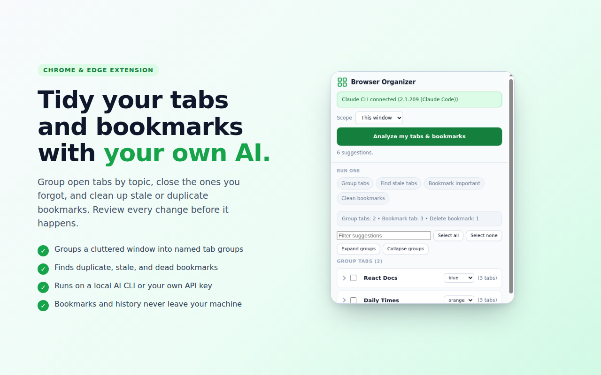
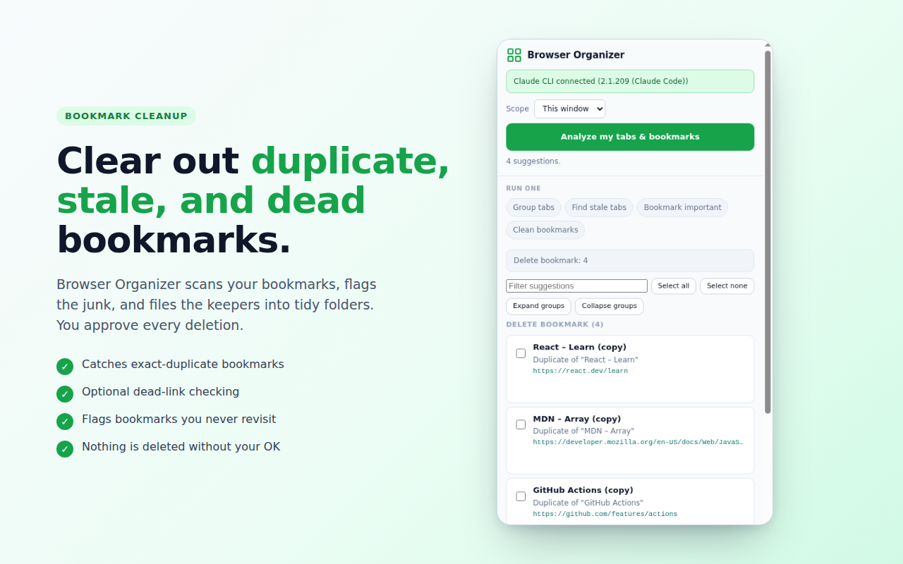
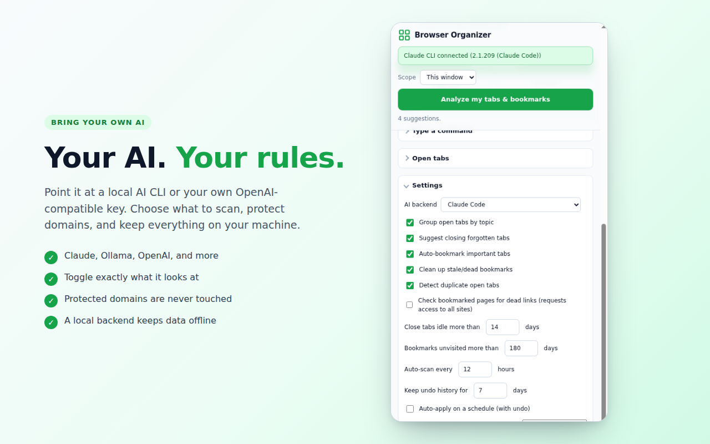

# Browser Organizer

A Chrome and Edge extension that cleans up your tabs and bookmarks with an AI backend you bring yourself. Point it at a local AI CLI you've already signed into, or at any OpenAI-compatible API key. It groups open tabs by topic, flags the ones you forgot were open, files the pages worth keeping into bookmark folders, and clears out stale, dead, and duplicate bookmarks. Nothing happens until you approve it.

Your bookmarks and history stay on your machine. The only data that ever leaves is tab titles and URLs, and only to the provider you picked.

## Screenshots

| Organize a window | Clean up bookmarks | Bring your own AI |
|:---:|:---:|:---:|
|  |  |  |

## Requirements

- One backend: an OpenAI-compatible API key (nothing to install), or one of six supported AI CLIs you've installed and signed into. See [AI backends](#ai-backends) below.
- Chrome 116+ or Edge (any recent Chromium build).
- Node.js 20+ if you register the helper with `npx`. The standalone per-OS installer bundles its own runtime, so it needs no Node.

## AI backends

Choose a backend in **Settings → AI backend**. The extension hands each request to a small local helper (the native host), which runs that backend and returns the result. Secrets live on the host, never in the extension, and the only traffic leaving your machine is the backend's own call to its provider. Ollama is the exception: it runs the model locally, so with it selected nothing leaves at all.

Seven backends ship today. The first six are command-line tools; the last talks to an HTTP API directly.

| Backend | Command / transport | How it's invoked | Auth |
|---------|---------|------------------|------|
| Claude Code *(default)* | `claude` | `claude -p --output-format json` | saved `claude` login |
| Antigravity | `agy` | `agy -p "<prompt>" --yes --no-color` | saved `agy` login, or `GEMINI_API_KEY` / `ANTIGRAVITY_API_KEY` |
| Kiro | `kiro-cli` | `kiro-cli chat --no-interactive "<prompt>"` | `KIRO_API_KEY` (Kiro Pro and up) |
| GitHub Copilot | `copilot` | `copilot -p "<prompt>" -s --no-ask-user` | Copilot subscription via `COPILOT_GITHUB_TOKEN` / `GH_TOKEN`, or an existing `gh` login |
| OpenAI Codex | `codex` | `codex exec --skip-git-repo-check "<prompt>"` | saved ChatGPT login, or `OPENAI_API_KEY` |
| Ollama | `ollama` | `ollama run <model>` (prompt on stdin) | none; fully local |
| OpenAI-compatible API | HTTP | `POST <base>/chat/completions` | API key in **Settings** (encrypted at rest), or `BROWSER_ORGANIZER_OPENAI_API_KEY` |

Claude Code is the backend the extension falls back to when you haven't picked one; switch to any of the other six in **Settings** and they all work the same way. Five of the six CLIs return plain text and Claude returns JSON, but either way the host pulls out the strict JSON that the extension's prompts request.

The installer bakes in the absolute path of each CLI it finds. To override where a binary lives, set its env var: `BROWSER_ORGANIZER_CLI` (Claude), `BROWSER_ORGANIZER_ANTIGRAVITY_CMD`, `BROWSER_ORGANIZER_KIRO_CMD`, `BROWSER_ORGANIZER_COPILOT_CMD`, `BROWSER_ORGANIZER_CODEX_CMD`, or `BROWSER_ORGANIZER_OLLAMA_CMD`. Ollama's model comes from `BROWSER_ORGANIZER_OLLAMA_MODEL` (default `llama3.2`). If a CLI authenticates with an API key, export that key in the environment the browser launches from; the host inherits it.

### OpenAI-compatible API backend

This backend calls any `/chat/completions`-shaped endpoint straight from the native host, with no CLI in between.

The simple path: choose **OpenAI-compatible API** in **Settings** and paste your key there, along with an optional base URL and model. The key is encrypted at rest (AES-GCM, using a non-extractable WebCrypto key) in this browser's local storage on this device. It never lands in `storage.sync`, and it never leaves except as a request to the endpoint you configured. On each request the extension hands it to the local helper, and the helper makes the call.

For headless or scripted setups, skip the UI and set host-side env vars instead. They take over when no key is entered in Settings:

- `BROWSER_ORGANIZER_OPENAI_API_KEY`: bearer token
- `BROWSER_ORGANIZER_OPENAI_BASE_URL`: default `https://api.openai.com/v1`
- `BROWSER_ORGANIZER_OPENAI_MODEL`: default `gpt-4o-mini`

One adapter covers OpenAI, OpenRouter, Groq, Together, and local servers like LM Studio or vLLM; just repoint the base URL. Unlike the CLI subscriptions, this route is metered per token, and a local endpoint keeps everything on-device.

## Install (developer / unpacked)

> Handing a build to testers before the store release? [docs/TESTING.md](docs/TESTING.md) is a short, cross-platform walkthrough for loading it on Windows, macOS, and Linux.

1. Load the extension.
   - Chrome: open `chrome://extensions`, turn on Developer mode, click **Load unpacked**, and pick `extension/`.
   - Edge: the same steps at `edge://extensions`.

   The extension ID is pinned by a key in the manifest, so it's identical in both browsers and step 2 already knows it.
2. Register the native messaging host so the extension can reach your backend. From any directory:
   ```
   npx @lusktech/browser-organizer-host
   ```
   From a clone you can instead run `node native-host/installer.js`, which defaults to the pinned ID and registers both Chrome and Edge. Either way the host is copied into `~/.browser-organizer` (macOS/Linux) or `%LOCALAPPDATA%\BrowserOrganizer` (Windows), so the repo or bundle is safe to delete afterward. Non-technical users can grab the per-OS installer from the releases page and skip Node entirely; see [INSTALL.md](INSTALL.md).
3. Open the side panel from the toolbar icon and click **Analyze my tabs & bookmarks**.

## How it works

The extension collects tab and bookmark metadata, then passes it to the local Node host over Chrome Native Messaging. The host runs whichever backend you selected, gets a set of suggestions back, and returns them. The only network traffic is your chosen provider's normal subscription or API call; no server of ours sits in the path. Destructive actions wait for your approval, and in auto mode they're logged so one click undoes them.

## Development

`npm test` runs the unit suite (`node --test`, no browser needed).

## End-to-end tests

`npm run e2e` runs the Playwright suite in `e2e/`. It loads the real extension into Chrome for Testing, drives the side panel, and exercises the whole path down through the native host. Most specs are deterministic and need no CLI; a few (marked *CLI*) drive a real backend and can be skipped.

Deterministic specs:
- **health**: the panel reports the backend connected
- **tab-panel**: search, filter, and bulk-close on open tabs (no AI); closing the selected tabs, then restoring them with undo
- **duplicate-tabs**: spots a duplicate open tab, closes it on apply, restores it on undo
- **sessions**: saves the current window as a session (closing its tabs), then restores them
- **bookmark-cleanup**: spots a duplicate bookmark, deletes it on apply, restores it on undo
- **dom-panel**: the real UI from end to end, covering *Clean bookmarks*, *Apply all*, the toast *Undo*, editing a proposed group (rename, drop a tab) followed by *Apply this group*, and the settings form persisting
- **auto-apply**: `onInstalled` schedules the alarms; auto mode applies tab actions but never auto-deletes bookmarks

CLI-backed specs (they use whichever backend is configured, which defaults to `claude`):
- **grouping**: clusters tabs and checks that a real Chrome tab group forms
- **command**: turns a natural-language instruction into an actionable plan
- **stale-tabs**: seeds a long-idle tab and checks the backend proposes closing or suspending it

Dead-link detection's HTTP logic has its own real-server integration test (`test/dead-link-integration.test.js`, part of `npm test`). The full in-browser dead-link flow isn't automated, because granting the optional `<all_urls>` permission needs a Chrome prompt that can't be accepted headlessly.

To run the suite on Linux, WSL, or CI you need the default CLI (`claude`) on PATH plus `xvfb` for a virtual display; the `e2e` script wraps the run in `xvfb-run`. Google Chrome's branded builds dropped `--load-extension`, so the suite uses Playwright's bundled Chromium (Chrome for Testing); install it once with `npx playwright install chromium`. Set `BORG_SKIP_CLI=1` to skip the CLI-backed grouping test in offline or fast CI. The fixture registers the native host on its own, so there's no manual install-host step.
